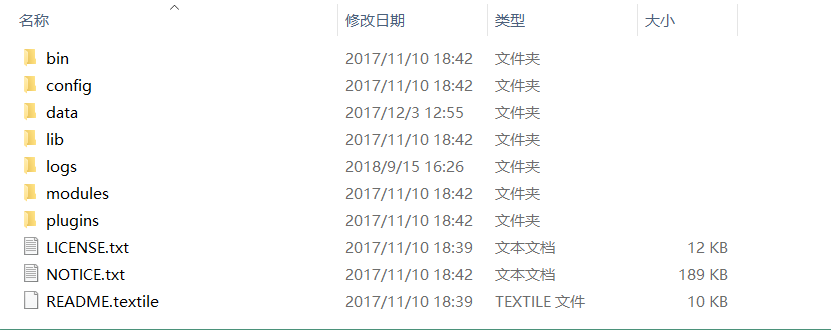
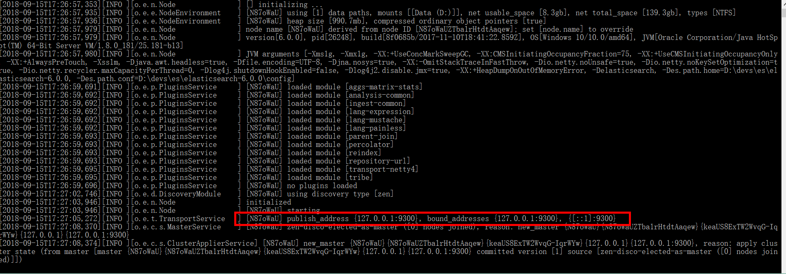
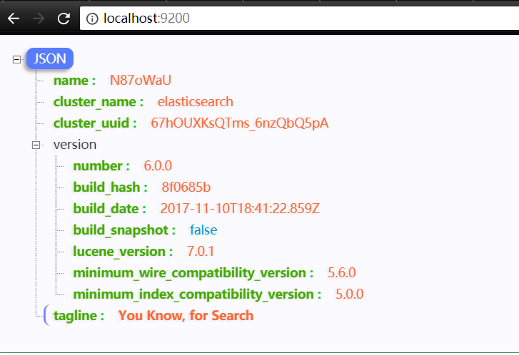
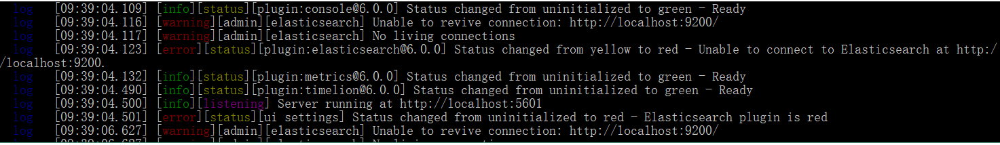
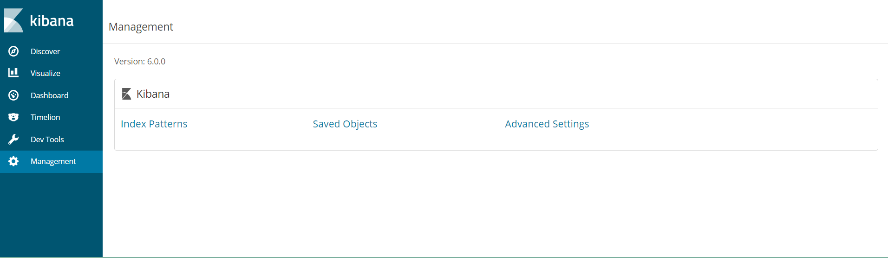
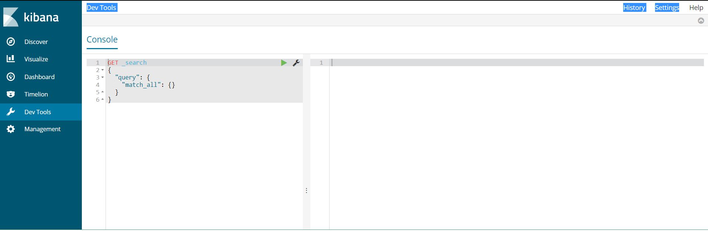

&nbsp;&nbsp;&nbsp;&nbsp;这篇文章主要是为了复习下对ElasticSearch。关于全文检索的知识这里暂且不再阐述。
## 安装ES

### 下图是ES下载后的解压目录



### 启动服务

&nbsp;&nbsp;&nbsp;&nbsp;运行elasticsearch.bat，这篇文章环境实在windows目录下面。如下图说明启动成功啦！


&nbsp;&nbsp;&nbsp;&nbsp;可以看到服务端监听的端口是9300.但是这个9300端口是RestAPI向外暴露的端口，我们应该访问的是localhost:9200;就会出现如下的界面：


&nbsp;&nbsp;&nbsp;&nbsp;上面代码中，请求9200端口，Elastic 返回一个 JSON 对象，包含当前节点、集群、版本等信息。
## kibana的使用
kibana是ES操作的图形化界面，下载对应版本的kibana安装。进入bin目录，运行kibana.bat。如果出现如下的界面，说明kibana.启动成功。


访问localhost:5601,如下的界面：



点击Dev Tools


在上述中可以进行操作。

```
# PUT表示修改修改修改,如果不存在该数据，则表示添加
PUT /demo/user/1
{
  "name":"gosaint"
}
```
看如下操作的结果：

```
{
  "_index": "demo",
  "_type": "user",
  "_id": "1",
  "_version": 1,
  "result": "created",
  "_shards": {
    "total": 2,
    "successful": 1,
    "failed": 0
  },
  "_seq_no": 0,
  "_primary_term": 1
}
```
然后再来获取：

```
#GET表示获取数据，都是以RESTful格式对数据进行操作的
GET /demo/user/1
```
看如下操作的结果：
```
{
  "_index": "demo",
  "_type": "user",
  "_id": "1",
  "_version": 1,
  "found": true,
  "_source": {
    "name": "gosaint"
  }
}
```

