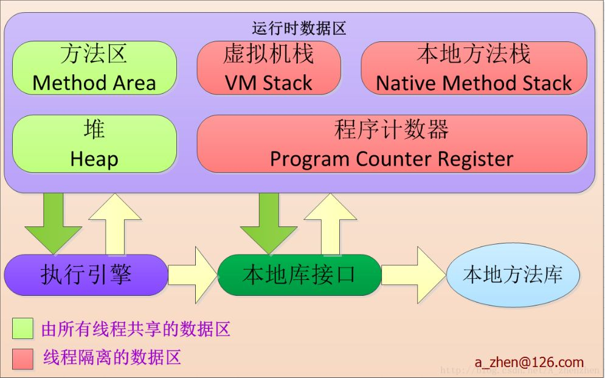
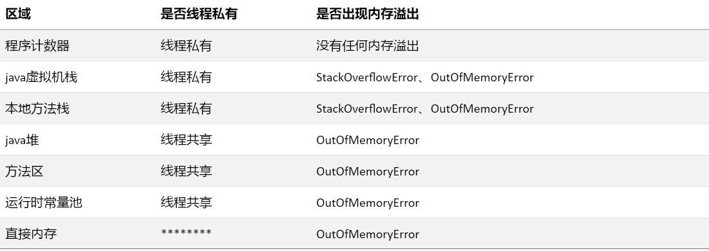

## java虚拟机运行时数据区内存划分
&nbsp;&nbsp;&nbsp;&nbsp;&nbsp;&nbsp;&nbsp;&nbsp;对于java虚拟机而言，在JVM执行java程序的过程中会将自己管理的内存区域划分为几个不同的位置，以便于管理。有的区域随着JVM的启动而分配内存，有的区域随着线程的启动创建空间，随着线程的结束而释放空间。就JVM而言，运行时数据区划分为程序计数器，本地方法栈，方法区，堆空间，java虚拟机栈5块区域。
看如下图所示：


&nbsp;&nbsp;&nbsp;&nbsp;&nbsp;&nbsp;&nbsp;&nbsp;对如上区域做一个分析汇总




### 程序计数器
&nbsp;&nbsp;&nbsp;&nbsp;&nbsp;&nbsp;&nbsp;&nbsp;

&nbsp;&nbsp;&nbsp;&nbsp;&nbsp;&nbsp;&nbsp;&nbsp;是一块较小的内存，它可以看做是当前线程所执行字节码的行号指示器。字节码的解释工作都是通过改变程序计数器的值来获取下一条所要执行的指令。程序的分支、循环、跳转、异常处理等基础功能都要依赖这个计数器完成。因此每一个线程都有一个程序计数器，他是线程私有的，不会出现任何的内存溢出错误。

### java虚拟机栈

&nbsp;&nbsp;&nbsp;&nbsp;&nbsp;&nbsp;&nbsp;&nbsp;java虚拟机栈描述的是java方法的内存模型。存储数据如下：
局部变量表：主要是编译器可知的基本数据类型，对象引用，返回值地址。由于局部变量表的数据在编译器可知，因此一个方法在栈中分配多大的内存就已经在编译器可知啦。会出现StackOverflowError,以及OutOfMemoryError。

### 本地方法栈

&nbsp;&nbsp;&nbsp;&nbsp;&nbsp;&nbsp;&nbsp;&nbsp;本地方法栈和java虚拟机栈的情况基本一致。只不过本地方法栈描述的是native方法的内存模型。会出现StackOverflowError,以及OutOfMemoryError。

&nbsp;&nbsp;&nbsp;&nbsp;&nbsp;&nbsp;&nbsp;&nbsp;关于栈溢出的错误代码实例如下：
```java
public class StackOver {
	public static void main(String[] args) {
		bad(1);
	}
	
	public static int bad(int n){	
	    return (n==0)? 0: bad(n/3+1)+n-1;          
	}
}
```
错误结果如下所示：
```java
Exception in thread "main" java.lang.StackOverflowError
	at jvm.StackOver.bad(StackOver.java:10)
	at jvm.StackOver.bad(StackOver.java:10)
```

### java堆

&nbsp;&nbsp;&nbsp;&nbsp;&nbsp;&nbsp;&nbsp;&nbsp;所有的对象实例以及数组都要在堆上分配内存。是垃圾收集器管理的主要区域。因此java对也称之为GC堆，我习惯上称为垃圾堆。由于现在的JVM都采用分带收集算法收集垃圾，java堆可以细分为：新生代和老年代。新生代又分为：Eden,from Survivor 、 to Survivor.java堆在物理上不是连续的，只要在逻辑上连续即可。堆的大小可以通过设置Xmx 和 Xms确定。

### 方法区

&nbsp;&nbsp;&nbsp;&nbsp;&nbsp;&nbsp;&nbsp;&nbsp;存储了jvm加载的类信息、常量、静态变量、以及即时编译器编译的类数据。JVM也会对这部分内存进行垃圾回收的管理。这部分也被称之为永久代，这是因为这部分的垃圾很少被收集。也会出现OutOfMemoryError。

### 运行时常量池

&nbsp;&nbsp;&nbsp;&nbsp;&nbsp;&nbsp;&nbsp;&nbsp;运行时常量池是方法区的一部分，class文件中除了有类的版本，字段、方法、接口等信息外，还有一部分就是运行时常量池。用于存放编译器生成的字面量和符号引用等信息。也会出现OutOfMemoryError。

### 直接内存

&nbsp;&nbsp;&nbsp;&nbsp;&nbsp;&nbsp;&nbsp;&nbsp;直接内存并不是方JVM的一部分，也不是运行时数据区的一部分，但是也会发生OutOfMemoryError。关于这部分内容，我就不做深入研究啦。

### OutOfMemoryError

1 堆溢出
程序实例代码如下：

```java
public class HeapOOM {
	
	static class OOMObject {
	}

	public static void main(String[] args) {
		List<OOMObject> list = new ArrayList<>();
		while (true) {
			list.add(new OOMObject());
		}
	}
}

```
设置运行参数：

```java
-Dfile.encoding=UTF-8   		# 文件编码 
-Xms20m -Xmx20m				# 堆的最大空间
-XX:+HeapDumpOnOutOfMemoryError         # 堆溢出快照
-XX:HeapDumpPath=D:\Dumping		# 堆快照文件存储的位置
-XX:SurvivorRatio=8
```
在这说明一点将堆的最大和最小内存设置相同是避免堆内存的自动扩展。
错误结果如下：
```java
Exception in thread "main" java.lang.OutOfMemoryError: Java heap space
	at java.util.Arrays.copyOf(Arrays.java:3210)
	at java.util.Arrays.copyOf(Arrays.java:3181)
	at java.util.ArrayList.grow(ArrayList.java:265)
	at java.util.ArrayList.ensureExplicitCapacity(ArrayList.java:239)
	at java.util.ArrayList.ensureCapacityInternal(ArrayList.java:231)
	at java.util.ArrayList.add(ArrayList.java:462)
	at jvm.HeapOOM.main(HeapOOM.java:14)
```

2 栈溢出
关于这部分栈溢出的代码，在上述讲到栈溢出的时候已经贴出了，即StackOverflowError.这部分很难出现OutOfMemoryError.

3 方法区和运行时常量池的溢出
关于这部分栈溢出的代码，在上述讲到栈溢出的时候已经贴出了，即StackOverflowError.这部分很难出现OutOfMemoryError.
下面的测试针对的是字符串常量池，因为字符串常量池已经存在于堆空间啦。所以这部分的测试也可以看成是堆溢出的测试，在java7之前，字符串常量池属于方法区的，7之后就在堆上分配内存啦。
```java
public class RuntimeOOM {

    public static void main(String[] args) {
      
        List<String> list = new ArrayList<String>();  
        int i = 0;  
        while(true){  
            list.add(String.valueOf(i++).intern());  
        }  
    }
}

```
设置启动参数：-Xms5m -Xmx5m
报错如下：
```java
Exception in thread "main" java.lang.OutOfMemoryError: GC overhead limit exceeded
	at java.lang.Integer.toString(Integer.java:401)
	at java.lang.String.valueOf(String.java:3099)
	at jvm.RuntimeOOM.main(RuntimeOOM.java:13)
```
GC overhead limit exceeded这个意思是说GC时间过长啦。
```java
sun官方说明：并行/并发回收器在GC回收时间过长时会抛出OutOfMemroyError。过长的定义是，超过98%的时间用来做GC并且回收了不到2%的堆内存。用来避免内存过小造成应用不能正常工作。

```


