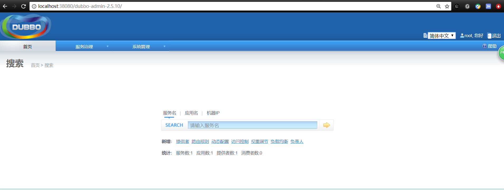
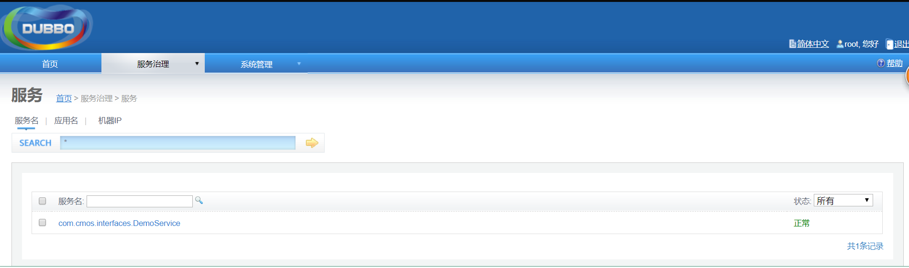

&nbsp;&nbsp;&nbsp;&nbsp;介绍下dubbo入门示例

&nbsp;&nbsp;&nbsp;&nbsp;1 公共的API接口，可以新建为一个Module
```java
public interface DemoService {
    String sayHello(String name);
}
```
&nbsp;&nbsp;&nbsp;&nbsp;1 提供者实现，可以新建为一个Module
```java
public class DemoServiceImpl implements DemoService {
    public String sayHello(String name) {
        return "Hello " + name;
    }
}
```
配置资源文件：

```xml
<?xml version="1.0" encoding="UTF-8"?>
<beans xmlns="http://www.springframework.org/schema/beans"
       xmlns:xsi="http://www.w3.org/2001/XMLSchema-instance"
       xmlns:dubbo="http://code.alibabatech.com/schema/dubbo"
       xsi:schemaLocation="http://www.springframework.org/schema/beans
       http://www.springframework.org/schema/beans/spring-beans.xsd
       http://code.alibabatech.com/schema/dubbo
       http://code.alibabatech.com/schema/dubbo/dubbo.xsd">
    <!--应用名称-->
    <dubbo:application name="demo-provider"/>
    <!--注册中心 这里使用Zookeeper-->
    <dubbo:registry address="zookeeper://127.0.0.1:2182"/>
    <!--用dubbo协议在20880端口暴露服务-->
    <dubbo:protocol name="dubbo" port="20885"/>
    <!--接口以及实现类-->
    <dubbo:service interface="com.cmos.interfaces.DemoService" ref="demoService" />
    <bean id="demoService" class="com.cmos.service.DemoServiceImpl"/>
</beans>
```
启动生产者：

```java
public class Provider {
    public static void main(String[] args) throws Exception {
        ClassPathXmlApplicationContext context = new ClassPathXmlApplicationContext(
                new String[] {"META-INF/spring/dubbo-demo-provider.xml"});
        context.start();
        System.out.println("服务启动！");
        System.in.read();
    }
}
```
&nbsp;&nbsp;&nbsp;&nbsp;1 消费者实现，可以新建为一个Module


```java
public class Consumer {
    public static void main(String[] args) throws Exception {
        ClassPathXmlApplicationContext context = new ClassPathXmlApplicationContext
                (new String[] {"META-INF/spring/dubbo-demo-consumer.xml"});
        context.start();
        DemoService demoService = (DemoService)context.getBean("demoService"); // 获取远程服务代理
        String hello = demoService.sayHello("world"); // 执行远程方法
        System.out.println( hello ); // 显示调用结果
    }
}
```
配置资源文件：

```xml
<?xml version="1.0" encoding="UTF-8"?>
<beans xmlns="http://www.springframework.org/schema/beans"
       xmlns:xsi="http://www.w3.org/2001/XMLSchema-instance"
       xmlns:dubbo="http://code.alibabatech.com/schema/dubbo"
       xsi:schemaLocation="http://www.springframework.org/schema/beans
       http://www.springframework.org/schema/beans/spring-beans.xsd
       http://code.alibabatech.com/schema/dubbo
       http://code.alibabatech.com/schema/dubbo/dubbo.xsd">
    <!--应用名称-->
    <dubbo:application name="demo-consumer"/>
    <!--注册中心 这里使用Zookeeper-->
    <dubbo:registry address="zookeeper://127.0.0.1:2182"/>
    <dubbo:reference id="demoService" interface="com.cmos.interfaces.DemoService"/>

</beans>
```
对于提供者和消费者，依赖是相同的：

```xml
        <dependency>
            <groupId>com.alibaba</groupId>
            <artifactId>dubbo</artifactId>
            <version>2.6.2</version>
        </dependency>
        <dependency>
            <groupId>org.apache.curator</groupId>
            <artifactId>curator-framework</artifactId>
            <version>2.12.0</version>
        </dependency>
```
正常启动生产者和消费者即可。之后我们启动dubbo-admin。关于dubbo-admin的配置参见其他资料。配置完毕后访问（对我而言）http://localhost:38080/dubbo-admin-2.5.10  如下图所示：




