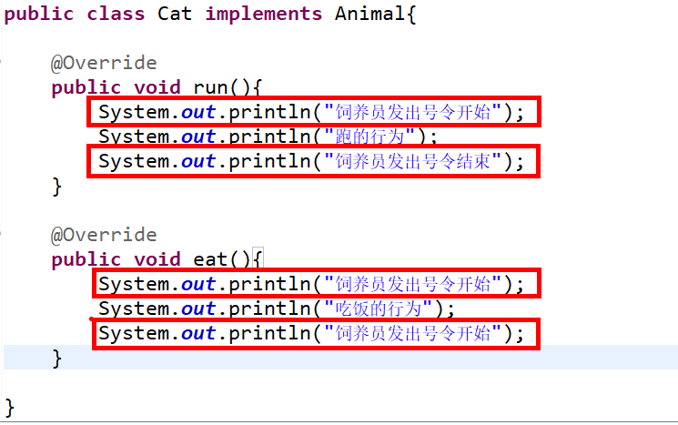

&nbsp;&nbsp;&nbsp;&nbsp;对于动态代理,这点来说我想大家都不会陌生。那么什么是动态代理呢：简而言之就是在运行期动态的生成字节码的技术。

## 1 存在的问题
&nbsp;&nbsp;&nbsp;&nbsp;在说明问题之前，我们先通过如下的代码逐步演进。
```java
public class Dog {

	public void run(){
		System.out.println("跑的行为");
	}
	
	public void eat(){
		System.out.println("吃饭的行为");
	}

}
```

```java
public class Cat {

	public void run(){
		System.out.println("跑的行为");
	}
	
	public void eat(){
		System.out.println("吃饭的行为");
	}

}
```
&nbsp;&nbsp;&nbsp;&nbsp;我想在这里大家都看到问题了吧，而且都可以解决该问题。通过抽取父类的方式或者抽取公共接口的方式就可以将上述的问题得以解决。我们这里抽取公共的接口
```java
public interface Animal {
	
	void run();
	
	void eat();
}

```
&nbsp;&nbsp;&nbsp;&nbsp;然后我们修改上述代码，让两个类去实现这个接口。拿Cat这个类来说吧。代码如下：

```java
public class Cat implements Animal{
	
	@Override
	public void run(){
		System.out.println("跑的行为");
	}
	
	@Override
	public void eat(){
		System.out.println("吃饭的行为");
	}

}
```
&nbsp;&nbsp;&nbsp;&nbsp;但是现在情况发生了变化，要求动物们在跑和吃东西之前必须由动物饲养员发出号令。
```java
public class Cat implements Animal{
	
	@Override
	public void run(){
		System.out.println("饲养员发出号令开始");
		System.out.println("跑的行为");
		System.out.println("饲养员发出号令结束");
	}
	
	@Override
	public void eat(){
		System.out.println("饲养员发出号令开始");
		System.out.println("吃饭的行为");
		System.out.println("饲养员发出号令开始");
	}

}


```




## Quick Start
## Quick Start
## Quick Start
## Quick Start

### Create a new post

``` bash
$ hexo new "My New Post"
```

More info: [Writing](https://hexo.io/docs/writing.html)

### Run server

``` bash
$ hexo server
```

More info: [Server](https://hexo.io/docs/server.html)

### Generate static files

``` bash
$ hexo generate
```

More info: [Generating](https://hexo.io/docs/generating.html)

### Deploy to remote sites

``` bash
$ hexo deploy
```

More info: [Deployment](https://hexo.io/docs/deployment.html)
