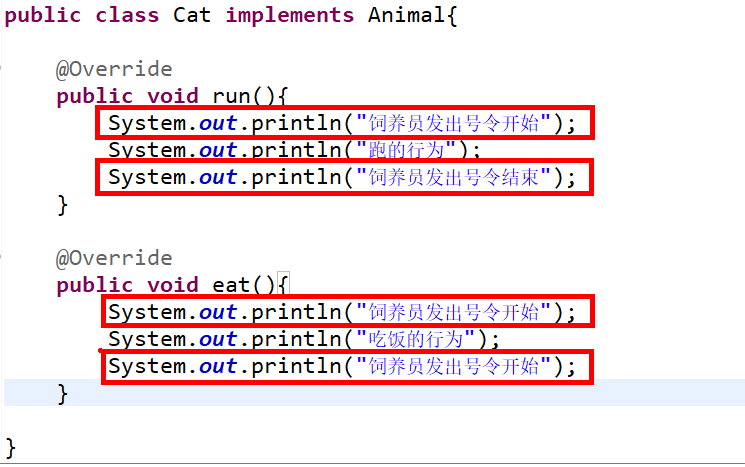
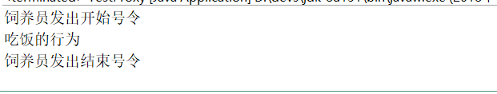

&nbsp;&nbsp;&nbsp;&nbsp;对于动态代理,这点来说我想大家都不会陌生。那么什么是动态代理呢：简而言之就是在运行期动态的生成字节码的技术。

## 1 存在的问题
&nbsp;&nbsp;&nbsp;&nbsp;在说明问题之前，我们先通过如下的代码逐步演进。
```java
public class Dog {

	public void run(){
		System.out.println("跑的行为");
	}
	
	public void eat(){
		System.out.println("吃饭的行为");
	}

}
```

```java
public class Cat {

	public void run(){
		System.out.println("跑的行为");
	}
	
	public void eat(){
		System.out.println("吃饭的行为");
	}

}
```
&nbsp;&nbsp;&nbsp;&nbsp;我想在这里大家都看到问题了吧，而且都可以解决该问题。通过抽取父类的方式或者抽取公共接口的方式就可以将上述的问题得以解决。我们这里抽取公共的接口
```java
public interface Animal {
	
	void run();
	
	void eat();
}

```
&nbsp;&nbsp;&nbsp;&nbsp;然后我们修改上述代码，让两个类去实现这个接口。拿Cat这个类来说吧。代码如下：

```java
public class Cat implements Animal{
	
	@Override
	public void run(){
		System.out.println("跑的行为");
	}
	
	@Override
	public void eat(){
		System.out.println("吃饭的行为");
	}

}
```
&nbsp;&nbsp;&nbsp;&nbsp;但是现在情况发生了变化，要求动物们在跑和吃东西之前必须由动物饲养员发出号令。
```java
public class Cat implements Animal{
	
	@Override
	public void run(){
		System.out.println("饲养员发出号令开始");
		System.out.println("跑的行为");
		System.out.println("饲养员发出号令结束");
	}
	
	@Override
	public void eat(){
		System.out.println("饲养员发出号令开始");
		System.out.println("吃饭的行为");
		System.out.println("饲养员发出号令开始");
	}

}


```


&nbsp;&nbsp;&nbsp;&nbsp;标红的代码重复啦。如何解决呢？我们习惯于纵向抽取，但是横向的抽取确是不会或者说不熟悉。而且重复的代码和我们的业务代码相比没有关联。这就造成了代码的高耦合。基于这种方式，java提供了动态代理的方式去解决。首先我们需要一个类去实现接口InvocationHandler。创建一个方法，并且该方法会返回我们代理对象。
```java
public class AnimalsProxy<T> implements InvocationHandler {
	
	private T target;
	
	@SuppressWarnings("unchecked")
	public T getInstance(T target){
		this.target=target;
		return (T) Proxy.newProxyInstance(target.getClass().getClassLoader(), 
				target.getClass().getInterfaces(), this);
		
	} 
	/**
	 * Object proxy 被代理的目标类
	 * Method method 执行的方法
	 * Object[] args 参数
	 */
	@Override
	public Object invoke(Object proxy, Method method, Object[] args) throws Throwable {
		startHexo();
		Object ret = method.invoke(target, args);
		sendtHexo();
		return ret;
	}
	
	private void startHexo(){
		System.out.println("饲养员发出开始号令");
	}
	
	private void sendtHexo(){
		System.out.println("饲养员发出结束号令");
	}

}

```
我们的测试：

```java
public class TestProxy {

	public static void main(String[] args) {

		Animal instance = new AnimalsProxy<Animal>().getInstance(new Dog());
		instance.eat();

	}

}
```

假设我将上述的代码修改下，将测试代码中的Animal换成Dog,那么就会出现如下的错误：

```java
Exception in thread "main" java.lang.ClassCastException: com.sun.proxy.$Proxy0 cannot be cast to proxy.Dog
	at proxy.TestProxy.main(TestProxy.java:7)
```
这是因为基于java的动态代理必须要实现接口。并且此时的instance还是代理对象（proxy.Dog@6bc7c054），不是真的animal对象

