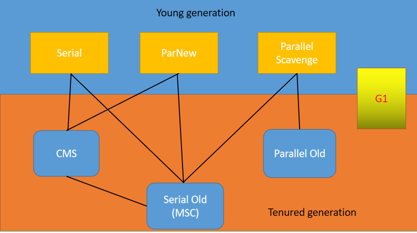
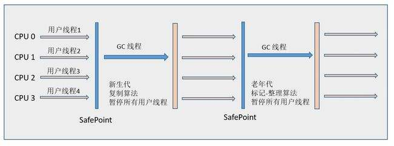
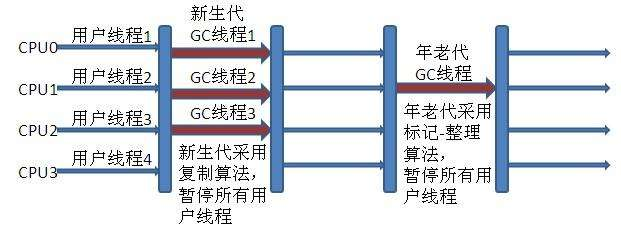
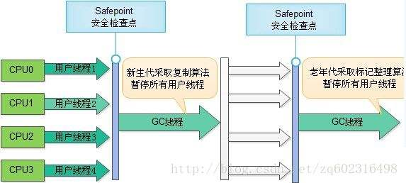
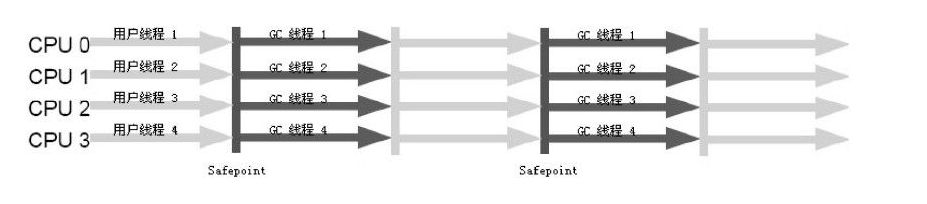

&nbsp;&nbsp;&nbsp;&nbsp;前面几篇文章分别介绍了JVM的内存布局、以及JVM垃圾回收算法和JVM对象生命状态的判断等。今天主要介绍下JVM的垃圾回收器。主流的JVM垃圾回收的实现。下图是HotSpot的垃圾收集器。

&nbsp;&nbsp;&nbsp;&nbsp;阐述下，通过java -version命令可以看到JVM处于何种模式下运行；分为Server和Client模式。Server模式下主要是使用Parallel Scavenge收集新生代，使用Parallel Old收集老年代。Client模式下主要是使用Serial收集新生代、使用Serial Old收集老年代。 

### Serial收集器
&nbsp;&nbsp;&nbsp;&nbsp;下面的图片是Serial收集器的示意图。新生代使用复制算法，老年代使用标记清除算法收集垃圾。Serial是串行的意思。也就是说只存在一个线程对垃圾进行收集。是Client模式下的默认的垃圾收集器。单线程下的垃圾收集。Stop-the-World的时间较长。 

### ParNew收集器

&nbsp;&nbsp;&nbsp;&nbsp;上图是ParNew收集器的示意图。可以看出是Serial垃圾收集器的并发版本。它可以与CMS收集器配合使用。它第一次实现了垃圾收集器线程和工作线程同时的使用。在单核的情况下它不一定比Serial性能高。但是多核的情况下就不一样啦。 
### Parallel Scavenge收集器
&nbsp;&nbsp;&nbsp;&nbsp;它和ParNew也是一样的。并发垃圾收集。但是他注重于CPU的吞吐量。而CMS注重垃圾收集是停顿时间长短。可以使用参数来控制垃圾收集的最大时间。
### Serial Old收集器
&nbsp;&nbsp;&nbsp;&nbsp;它同样是一个单线程的收集器。使用标记整理算法收集老年代。

### Parallel Old收集器
&nbsp;&nbsp;&nbsp;&nbsp;它和Parallel Scavenge也是一样的。并发垃圾收集。但是它使用标记整理算法收集老年代。

### CMS收集器
&nbsp;&nbsp;&nbsp;&nbsp;CMS(Concurrent Mark Sweep),是一种获取最短回收停顿时间为目标的垃圾收集器。下图是CMS收集器的四个过程。在并发标记和并发清除阶段是和工作线程一起运行的。
#### 1 初始标记
	该阶段会产生stop-the-world;这个阶段只是标记下对象直接关联到GC Roots.
#### 2 并发标记
	标记GC Roots Trancing.这个阶段主要是标记那些之前对象到GC Roots的引用为空，但是后续有发生了变化的对象。该阶段的标记时间一般比初始标记时间稍微长些。但是比重新标记短。
#### 3 重新标记
	该阶段会产生stop-the-world
#### 4 并发清除
#### 缺点
	1 CMS收集器对CPU资源非常敏感
	2 无法处理浮动垃圾
	3 产生诸多的内存碎片（标记清除法的缺陷）

#### G1收集器
	对于该收集器是目前最为先进的java垃圾回收器。内容较为复杂。待后续说明。

