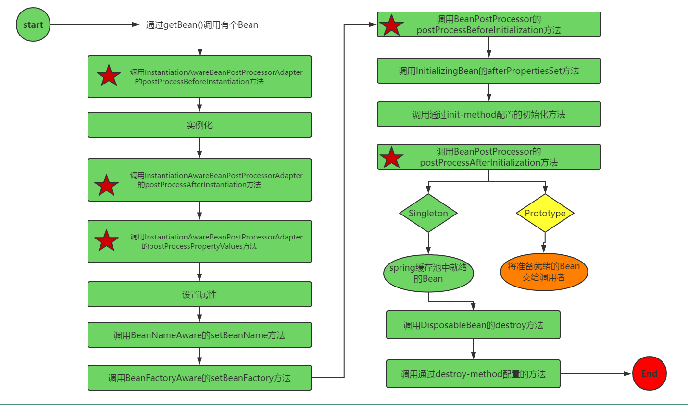

&emsp;&emsp;对于本人来说，Spring Bean的生命周期绝对是一个超级复杂的过程。因为它太多了我实在记不住。今天我正式的再文章中写下，算是一个记忆的过程吧。
下图是BeanFactory中Bean的生命周期。


### BeanFactory中Bean的生命周期
&emsp;&emsp;我这里使用的是Spring4.x企业实战上面的例子。先行创建一个Bean。Car

&emsp;&emsp;接下来需要实现四个接口：
* 1 BeanFactoryAware接口
此时需要实现方法setBeanFactory(BeanFactory beanFactory)。因此需要添加成员变量BeanFactory。

* 2 BeanNameAware接口
此时需要实现方法setBeanName(String beanName)。因此需要添加成员变量beanName。
* 3 InitializingBean接口
此时需要实现方法afterPropertiesSet()方法。

* 4 DisposableBean接口
此时需要实现方法destroy()方法。
&emsp;&emsp;自定义两个方法，一个位MyInit()方法、一个为MyDestroy()方法
经过实现上述的接口以及自定义的方法之后，Car的最终代码如下：

```java
public class Car implements BeanFactoryAware ,BeanNameAware,InitializingBean ,DisposableBean {

    //Bean的原始字段
    private String brand;
    private String color;
    private int maxSpeed;
    private BeanFactory beanFactory;
    private String beanName;

    public Car() {
    }

    public Car(final String brand, final String color, final int maxSpeed) {
        this.brand = brand;
        this.color = color;
        this.maxSpeed = maxSpeed;
    }

    public String getBrand() {
        return brand;
    }

    public void setBrand(final String brand) {
        this.brand = brand;
    }

    public String getColor() {
        return color;
    }

    public void setColor(final String color) {
        this.color = color;
    }

    public int getMaxSpeed() {
        return maxSpeed;
    }

    public void setMaxSpeed(final int maxSpeed) {
        this.maxSpeed = maxSpeed;
    }


    public void introduce() {
        System.out.println("Car{" +
                "brand='" + brand + '\'' +
                ", color='" + color + '\'' +
                ", maxSpeed=" + maxSpeed +
                '}');
    }


    //BeanFactoryAware接口
    @Override
    public void setBeanFactory(final BeanFactory beanFactory) throws BeansException {
        System.out.println("BeanFactoryAware接口-->Car.setBeanFactory被调用");
        this.beanFactory=beanFactory;
    }
    //BeanNameAware接口
    @Override
    public void setBeanName(final String name) {
        System.out.println("BeanNameAware接口-->Car.setBeanName被调用");
        this.beanName=name;
    }

    //InitializingBean接口
    @Override
    public void afterPropertiesSet() throws Exception {
        System.out.println("InitializingBean接口-->Car.afterPropertiesSet被调用");
    }


    //DisposableBean接口
    @Override
    public void destroy() throws Exception {
        System.out.println("DisposableBean接口-->Car.destroy被调用");
    }

    public void myInit(){
        System.out.println("Car.inits=================指定速度为280");
        this.maxSpeed=280;
    }

    public void myDestroy() throws Exception {
        System.out.println("Car.destroys==============自定义销毁bean");
    }
}

```
配置文件如下：

```xml
<?xml version="1.0" encoding="UTF-8"?>
<beans xmlns="http://www.springframework.org/schema/beans"
       xmlns:xsi="http://www.w3.org/2001/XMLSchema-instance"
       xmlns:context="http://www.springframework.org/schema/context" xmlns:p="http://www.springframework.org/schema/p"
       xsi:schemaLocation="http://www.springframework.org/schema/beans
       http://www.springframework.org/schema/beans/spring-beans.xsd
       http://www.springframework.org/schema/context
       http://www.springframework.org/schema/context/spring-context.xsd">

    
    <bean id="car" class="com.gosaint.beanlife.springlife.Car"
          init-method="myInit"
          destroy-method="myDestroy"
          p:brand="红旗CA72"
          p:maxSpeed="200"/>

</beans>
```
&emsp;&emsp;
### ApplicationContext中Bean的生命周期
